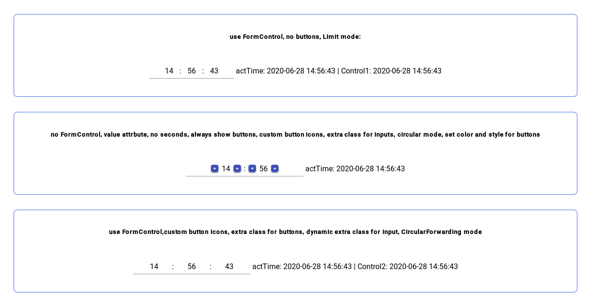

# AngularTimeInput

This is a test representation project for [NgnzTimeInput](https://github.com/naz-a/angular-time-input/tree/master/projects/ngnz-time-input) library included in this project.

You can get it to have look on some examples of use and try it by yourself.

_Screenshot_

