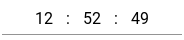
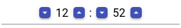
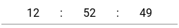

# NgnzTimeInput

This is a simple Angular 8 component is to be used to change time as MomentJs.Moment data type.
It is not influence to date part. It allows to change seconds.
You can use it as field in angular reactive form or separately by [value] attribute and (timeChange) event.
It depends on MomentJs, Angular MaterialDesign libraries.

## Look and Feel

**Example 1.** Input field with no buttons to change value. Use mouse wheel.\


**Example 2.** Input field with always shown buttons to change value. Defined Material Design style "mat-raised-button" and color "primary" Also possible to use mouse wheel. Part of seconds is hidden.\


**Example 3.** Input field with buttons shows on focus. Not focused. Use buttons or mouse wheel to change value.\


**Example 4.** Focused input field with custom buttons defined with CSS class shows on focus.\


**Example 5.** Focused input field with defined Material Design "mat-fab" style buttons\


## Usage

```
<mat-form-field appearance="standard" style="width: 250px;">
    <ngnz-time-input-inline
        color="accent"
        mat-raised-button
        [formControl]="timeInputControl"
        [increaseBtnIconName]="'keyboard_arrow_up'"
        [decreaseBtnIconName]="'keyboard_arrow_down'"
        (timeChange)="onTimeChange($event)"
    >
    </ngnz-time-input-inline>
</mat-form-field>
```

## Input parameters

-   _**color**: string_ - from Material theme: primary, accent, warn;

-   _**buttonMatType**: string_ - type of control buttons in Material Design: mat-button, mat-raised-button etc.

-   _**inputClasses**: string | string[] | {[key:string]:boolean}_ - additional css classes for input fields of hours, minutes and seconds

-   _**inputClasses**: string | string[] | {[key:string]:boolean}_ - additional css classes for control buttons

-   _**buttonDecreaseClasses**: string | string[] | {[key:string]:boolean}_ - additional css classes for decrease button on the left side of the input fieled

-   _**buttonIncreaseClasses**: string | string[] | {[key:string]:boolean}_ - additional css classes for increase button on the right side of the input fieled
-   _**inputMode**: TimeInputMode_ - enum defining of time change mode: 0-Limit, 1-Circular, 2-CircularForwarding
-   _**value**: Moment_ - value
-   _**splitter**: string_ - one character to separate hours from minutes and minutes from seconds; default is ':'
-   _**noButtons**: boolean_ - do not show control buttons; normally buttons are shown on focus
-   _**showButtons**: boolean_ - always show control buttons; normally buttons are shown on focus
-   _**noSeconds**: boolean_ - do not show seconds block if it is not necessary
-   _**decreaseBtnIconName**: string_ - mat icon name for descrease controll button; 'remove' by default
-   _**increaseBtnIconName**: string_ - mat icon name for increase control button; 'add' by default
